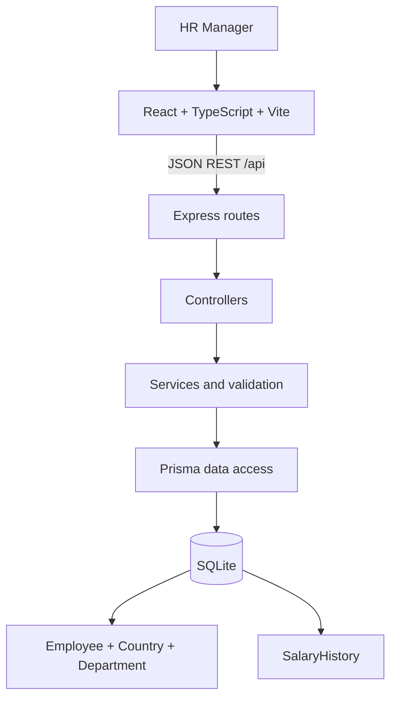

# Architecture

## Runtime shape

## Frontend

The Vite client has a small application shell and two feature areas: the workforce dashboard and employee directory/detail. Feature components call a typed API module; API errors are normalized at that boundary. The directory sends search, filters, sort order, and page parameters on each request. It keeps only the current page in memory. Employee detail loads the profile and salary history in parallel; the edit form submits a version token and refreshes the data after success.

## Backend and request flow

Express routes connect URL paths to controllers. Controllers parse request parameters/body with Zod and return HTTP responses. Services handle not-found, supported-currency, and concurrency rules. Repositories own employee lookup/list queries; dashboard services perform aggregates in SQLite/Prisma. Central error middleware maps validation, domain, Prisma uniqueness, and unexpected errors into one response shape.

## Data model

Country and Department are normalized references. Employee contains current employment and compensation, with compensation stored as integer minor units. Country/currency remain attached to each employee so dashboards never add unrelated currencies. SalaryHistory holds previous and new salary/bonus values, both currency codes when they differ, effective date, timestamp, and optional actor.

## Salary update transaction

The service opens one Prisma transaction, reads the employee, compares the submitted integer version, performs a conditional update that increments that version, then inserts the salary history row. A missing employee returns 404; a mismatched or raced version returns 409. Any exception rolls back both the current row and history insert. Authentication is not implemented, so the history actor is explicitly null.

## Important decisions

- Keep one Express process and one relational database; no queue or service split is needed for this assessment scale.
- Keep salary and bonus integer-based; calculate total compensation on read instead of storing a duplicate.
- Aggregate payroll, salary statistics, and salary distribution in SQLite. Median uses a window-function query, and results are grouped by native currency.
- Use integer version-based compare-and-swap for optimistic concurrency instead of timestamps, whose database precision could allow two quick updates to share a value.
